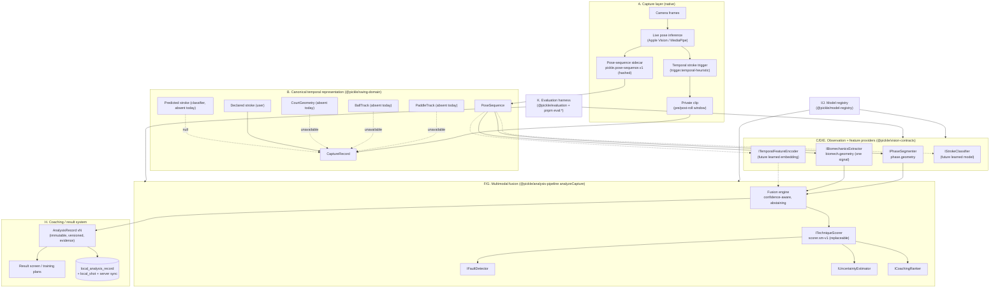

# ML SYSTEM

Pickle Sensei is built as a permanent ML platform: a decomposed, contract-driven
pipeline whose models, weights, datasets, and algorithms improve continuously
without the product being rebuilt around them. There is never one black-box
"good/bad stroke" model.

The research loop that feeds this platform (desktop harness, capture-quality
and evidence policies, dataset/annotation/benchmark pipeline, licensing-vetted
model roadmap) is documented in `docs/PERCEPTION.md`.

## A. Capture layer

Native camera code (iOS `PickleNative` pod / Android `com.picklesensei.camera`)
runs live pose inference, readiness gating, and the temporal stroke trigger,
then persists two artifacts per capture:

- the private clip (pre/post-roll motion window), and
- the **pose-sequence sidecar** (`stroke-<uuid>.pose.json`): every measured
  pose frame in the clip window with clip-relative timestamps, SHA-256 hashed
  and referenced from the capture payload (`poseSequence`).

Timestamps are monotonic and strictly increasing; missed inference frames are
real gaps, never interpolated. The sidecar is written in the framework-neutral
canonical format — nothing downstream depends on Apple Vision or MediaPipe
structures.

## B. Canonical representation (`@pickle/swing-domain`)

The versioned domain model every layer consumes:

- `CaptureRecord` — one recorded swing: device/video metadata, trigger window,
  `StrokeIdentity` (declared vs predicted are separate concepts), consent
  state, and per-modality `ModalityRecord`s.
- `PoseSequence` / `PaddleTrack` / `BallTrack` / `CourtGeometry` /
  `CameraCalibration` / `LearnedEmbedding` — temporal observations with
  explicit `CoordinateSystem` (2D today, optional `z` everywhere for 3D
  models later) and `ModelRef` provenance.
- `ModalityRecord<T>` is either `measured` (with provenance) or `unavailable`
  (with a reason). The type system has no way to express fabricated data.
- `AnalysisRecord` — an immutable, versioned analysis: stroke resolution,
  modality availability, every `ModelRunRecord`, the scored `ShotAnalysis`,
  faults, uncertainty, evidence, and shadow-model outcomes.
- Serialization (`pickle.pose-sequence.v1`) validates hard: unknown schema
  versions, non-monotonic timestamps, and malformed landmarks are rejected,
  never repaired.

## C. Observation providers (`@pickle/vision-contracts`)

Stable contracts, interchangeable implementations (deterministic code, Core
ML, ONNX, MediaPipe, server models, or future runtimes):

`IPoseProvider`, `IPaddleDetector`, `IBallTracker`, `ICourtDetector`,
`ICameraCalibrator`, `IStrokeDetector` (trigger), `IStrokeClassifier`,
`IPhaseSegmenter`, `IBiomechanicsExtractor`, `ITemporalFeatureEncoder`,
`ITechniqueScorer`, `IFaultDetector`, `IUncertaintyEstimator`,
`ICoachingRanker`. Every provider exposes a `ProviderDescriptor`
(id, version, runtime, execution target, artifact hash, schema versions).

Implemented today (all real, none fabricated): pose (Apple Vision /
MediaPipe), trigger (temporal heuristic), phase (geometry), biomechanics
(geometry), scorer (sm-v1), faults, uncertainty, coaching. Absent today:
paddle, ball, court, calibration, classifier, temporal encoder — absent means
`null` resolution and honest degradation, never guessing.

## D. Temporal representations

A swing is a sequence, not a bag of angles. Frame-level timing is preserved
end to end; phase spans (`ready → prepare → accelerate → contact →
follow_through → recover`) carry start/representative/end timestamps; nothing
assumes fixed clip durations or uniform player tempo. Event-relative windows
(contact, peak wrist speed, phase boundaries) are derived from the sequence at
analysis time.

## E. Feature extraction

`biomech.geometry` (in `@pickle/vision-geometry`) is the current
`IBiomechanicsExtractor`: deterministic, explainable, measured features with
per-metric confidence. It is ONE modality signal for fusion — explicitly not
"the Pickle Sensei model". A learned extractor replaces or complements it
under the same contract.

### Geometry measurement definitions (features-geometry-1)

Conventions: coordinates are aspect-corrected; lengths are divided by measured
torso length; "ground" is the median ankle line; "forward" is the measured
travel direction of the swinging wrist through accelerate. Confidence = mean
measured visibility of the joints used (paddle-proxy metrics ×0.75;
image-plane shoulder turn ×0.7 on side view). Unmeasurable metrics are
omitted so scoring abstains rather than receives fabricated values.

| Metric                        | Definition                                                                             |
| ----------------------------- | -------------------------------------------------------------------------------------- |
| `stance_width_ratio`          | Ankle separation ÷ shoulder separation at the ready representative frame.              |
| `knee_flexion_deg`            | 180° − interior hip–knee–ankle angle on the dominant side at ready.                    |
| `shoulder_turn_deg`           | Max image-plane angle between the shoulder line and hip line during preparation.       |
| `paddle_ready_height_ratio`   | (hip-center y − wrist y) ÷ torso length at ready (wrist proxy).                        |
| `paddle_set_height_ratio`     | Same measure at the end of preparation (wrist proxy).                                  |
| `paddle_set_forward_norm`     | Forward-signed wrist offset from hip center ÷ torso length at set (wrist proxy).       |
| `backswing_length_norm`       | Wrist path length across preparation ÷ torso length.                                   |
| `hip_shoulder_lag_ms`         | Time from peak hip-line angular speed to peak shoulder-line angular speed.             |
| `weight_transfer_norm`        | Forward-signed hip-center displacement, accelerate start → contact, ÷ torso length.    |
| `path_low_to_high_slope`      | Rise from the forward swing's lowest wrist point to contact ÷ its horizontal run.      |
| `contact_forward_of_hip_norm` | Forward-signed wrist offset from hip center ÷ torso length at contact.                 |
| `contact_height_ratio`        | Wrist height above ground ÷ shoulder height above ground at contact.                   |
| `wrist_angle_variance_deg`    | Std-dev of the unwrapped forearm (elbow→wrist) angle through the contact neighborhood. |
| `follow_through_length_norm`  | Wrist path length across follow-through ÷ torso length.                                |
| `recovery_time_ms`            | Recover span duration after follow-through ends.                                       |

## F. Fusion / scoring

`analyzeCapture` (`@pickle/analysis-pipeline`) is the multimodal fusion
engine: canonical capture in, immutable `AnalysisRecord` out. It supports
missing modalities, confidence-aware weighting, abstention, partial analysis,
and degraded operation. sm-v1 is decomposed into four independently
replaceable roles (`@pickle/scoring` adapters): `Sm1TechniqueScorer`
(interpretation + aggregation), `CheckpointThresholdFaultDetector`,
`EngineUncertaintyEstimator`, and `PriorityCoachingRanker`. A learned scorer
takes the scorer slot without touching measurement, faults, coaching, capture,
storage, or UI. Shadow scorers run on the same input without changing the
user-facing result; their outcomes are recorded in `AnalysisRecord.shadow`.

## G. Confidence / uncertainty

Every measurement, checkpoint, and analysis carries 0..1 confidence.
`UncertaintySummary` reports overall confidence, presentation
(`normal | lower_confidence | abstain`), per-checkpoint confidence, and
explicit `limitingFactors` (e.g. `paddle_track_unavailable`). Abstention
thresholds live in scoring config (abstain < 0.65; lower-confidence < 0.80).

## H. Coaching / results

Coaching claims are traceable: `AnalysisRecord.evidence` links each checkpoint
claim to its phase window, the measured metric keys that grounded it, the
producing provider, and confidence. Faults carry direction, severity, and
evidence. Priority ranking is dependency-aware (root causes over symptoms).

## I. Model registry (`@pickle/model-registry`)

Central resolution — the app never hardcodes model versions. Manifest entries
carry id, version, task, runtime, execution target, artifact hash/URI,
dataset/evaluation lineage, license, supported strokes/platforms, and
deployment status (`experimental | shadow | candidate | production |
deprecated`). `resolve()` returns the production implementation for a task or
null (honest absence); `shadowFor()` returns shadow candidates. The default
manifest ships in the package; remote manifests with hashed artifacts are the
delivery path for downloadable models (server registry: `scoring_model` +
`model_bundle` tables with release-evidence constraints, admin release
endpoint `PUT /v1/admin/scoring-models/:shotType/:version/release`).

## J. Versioning

Everything machine-produced knows what produced it: `ModelRef` (provider id,
model version, runtime, execution target, artifact hash) on every artifact,
`ModelRunRecord` per execution (schema versions in/out, timing, status),
`VersionVector` on every scored result (8 component versions), engine and
taxonomy versions on every `AnalysisRecord`, and `schemaVersion` on every
serialized structure. A 2026 score still knows in 2029 exactly what produced
it.

## K. Evaluation (`@pickle/evaluation` + `pnpm eval:*`)

Metrics: classification (accuracy, macro-F1, per-class precision/recall,
confusion), boundary timing error (mean/median/within-tolerance), score
agreement (MAE, Pearson, tie-aware Spearman), calibration (ECE + reliability
bins), and a regression gate (`regressionViolations`) so a candidate model
cannot silently degrade a benchmark metric. Benchmarks are versioned datasets
with explicit provenance (`synthetic | consented_first_party | commissioned |
licensed`). Current runnable benchmarks are synthetic-provenance (parametric
skeletons with constructed ground truth): phase segmentation (contact timing)
and scoring rank-ordering. They validate math and ordering behavior — coach
agreement requires first-party expert benchmarks, which do not exist yet.
Entry points: `pnpm eval:vision`, `pnpm eval:scoring`, `pnpm eval:all`.

## L. Dataset provenance

`datasets/pickleball/registry.json` records the audited finding: zero
commercially cleared public temporal pickleball datasets (verified
2026-08-27). Eligible data paths are consented first-party capture,
commissioned capture, and licensed media. Synthetic data is never
release-eligible and is always labeled. `ml/datasets/manifest.schema.json`
requires per-item SHA-256, athlete-disjoint splits, consent/rights/withdrawal
state, and review evidence.

## M. Annotation

`ml/annotations/annotation.schema.json` (v2): 61-technique taxonomy with
explicit `unknown_technique` / `no_stroke` / `partial` / `aborted` outcomes,
phase windows, contact ranges, checkpoint verdicts with fault direction and
severity, quality/occlusion flags, ≥2 independent annotators, coach
adjudication, and agreement tracking. `ml/scripts/validate_annotations.py`
enforces the ontology before release eligibility.

## N. Deployment

Execution targets are part of every provider descriptor (`on_device | server
| hybrid`); contracts are identical across targets. Deployment states flow
registry-first: experimental → shadow (runs beside production, recorded,
invisible to users) → candidate → production → deprecated. Downloadable
models require artifact hashes in the manifest; a failed model load is a
typed provider failure that the fusion engine reports — analysis never
crashes or silently substitutes.

## O. Reprocessing

Captures are immutable; analyses accumulate. The pose-sequence sidecar plus
`CaptureRecord` metadata are sufficient to re-run any future provider set
over a historical swing: `capture-123 → analyzeCapture(model-v8) →
analysis-v8` appends a new `local_analysis_record` row (and, when released
and permitted, a new product rating) without touching the original capture or
earlier analyses. Raw clips are retained under the product privacy policy so
video-input models can also reprocess where permitted.

## P. Privacy / consent boundary

Product telemetry and ML training data are separate populations. Every
capture carries `training_consent` (`not_asked | granted | denied`),
defaulting to `not_asked`, which every exporter treats as denied. Nothing
leaves the device as training data without explicit, versioned consent terms;
the dataset manifest requires per-item consent and withdrawal state, and
withdrawal purges derivatives (`ml/README.md`).

## LLM boundary (directive §26)

Vision measures → scoring decides → (later) LLM explains from structured
diagnoses only. No LLM in the real-time loop; no LLM ever invents what
happened in video.
